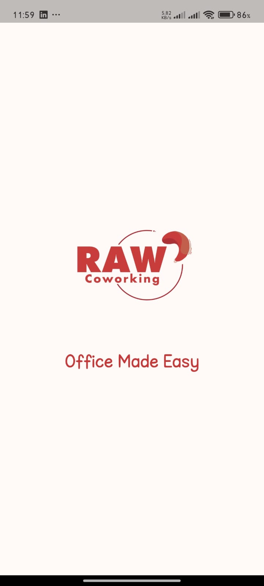
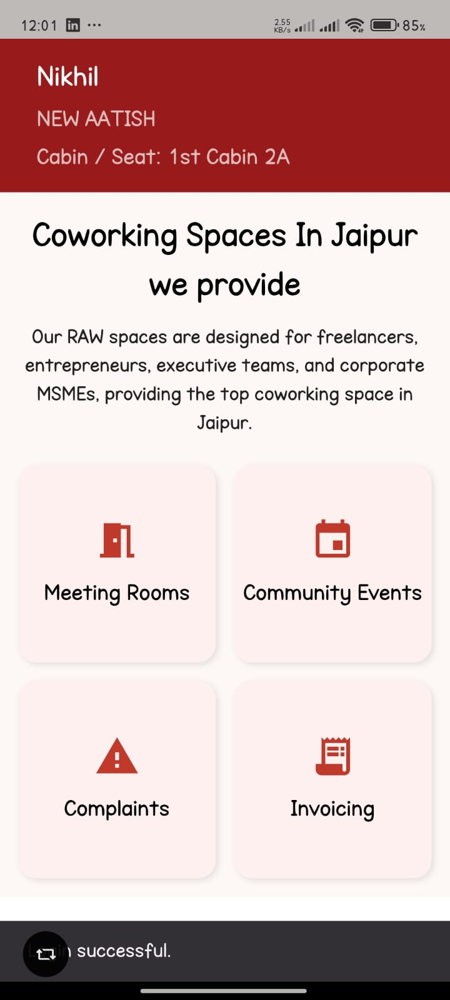
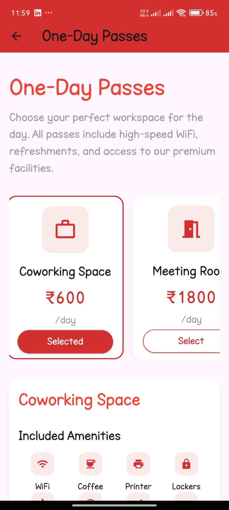
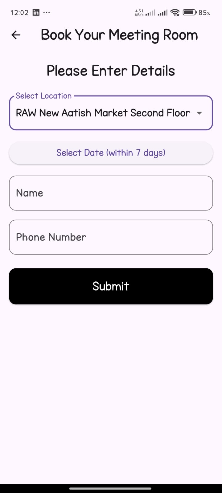
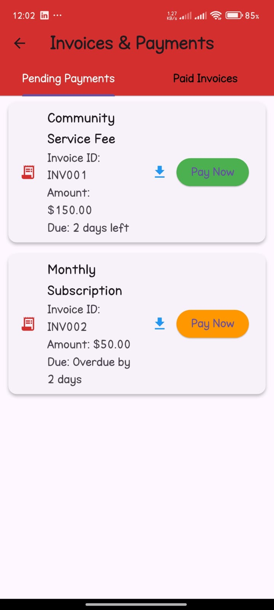
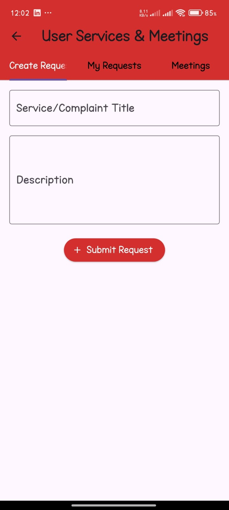
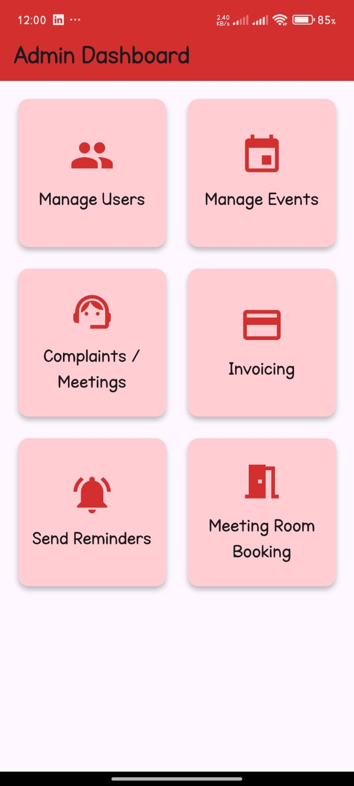
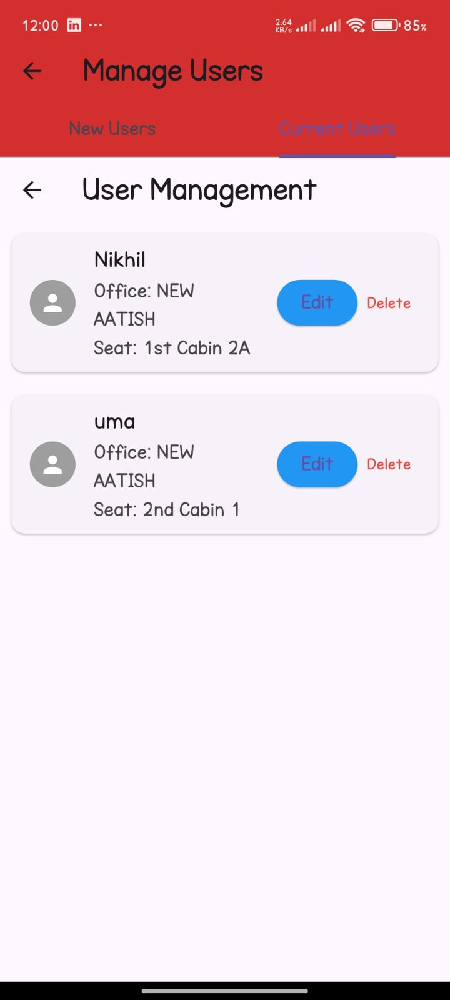

# RAW Coworking Space

A new Flutter project designed to streamline the coworking experience. This app provides a seamless interface for members to manage their workspace, payments, and bookings, while offering a comprehensive dashboard for administrators.

## ✨ App UI and Features
The app features a clean, modern, and intuitive user interface with a red and white color scheme. It's designed for both coworking members and administrators, with distinct dashboards and functionalities for each.

## User-Facing Features
   ### Splash & Home Screen
The app welcomes users with a clean splash screen before opening a personalized dashboard. The home screen shows the user's name, their assigned cabin/seat, and provides quick access to key features.

 ### Booking & Reservations
Users can easily book one-day passes for coworking spaces or reserve meeting rooms. The interface clearly displays pricing, amenities, and provides a simple form for scheduling.

  ### Invoicing & Service Requests
An integrated system for managing payments allows users to view pending invoices and their due dates. A dedicated section also lets users submit service requests or complaints with a title and description.

## Admin Dashboard & Management
   ### Admin Dashboard
A central hub for admins provides quick access to manage all aspects of the coworking space, including users, events, complaints, invoicing, and meeting room bookings.

   ### User Management
Admins have comprehensive tools to manage the community. They can view a list of all current users, edit their details, or add new members to the system through a simple and intuitive form.

The project is organized into a Flutter frontend and a Node.js backend, with a clear and scalable structure.

### Frontend (Flutter)
The Flutter application code is primarily located in the `lib` directory, separated into modules for admin, user pages, and general logic.

```
RAW-coworking-App/
├── lib/
│   ├── admin/
│   │   ├── admin_dashboard.dart
│   │   ├── complaints_meetings.dart
│   │   ├── current_users.dart
│   │   ├── event_manage.dart
│   │   ├── invoicing_page.dart
│   │   ├── meeting_room_booking.dart
│   │   ├── new_user.dart
│   │   └── send_reminders.dart
│   │
│   ├── login/
│   │   └── login.dart
│   │
│   ├── pages/
│   │   ├── ComplaintsPage.dart
│   │   ├── EventsPage.dart
│   │   ├── InvoicingPage.dart
│   │   ├── MeetingRoomPage.dart
│   │   ├── home_page.dart
│   │   ├── one_day_pass.dart
│   │   └── profile_section.dart
│   │
│   ├── main.dart
│   └── splash_screen.dart
│
├── assets/
├── android/
├── ios/
└── pubspec.yaml
```

### Backend (Node.js / Express)
The backend follows the MVC (Model-View-Controller) pattern to organize logic, data models, and API endpoints.

```
RAW-coworking-App/
└── backend/
    ├── controllers/
    │   ├── event.controller.js
    │   ├── invoice.controller.js
    │   ├── meeting.controller.js
    │   ├── serviceRequest.controller.js
    │   └── user.controller.js
    │
    ├── middleware/
    │   ├── auth.js
    │   └── isAdmin.js
    │
    ├── models/
    │   ├── Event.js
    │   ├── Invoice.js
    │   ├── meeting.model.js
    │   ├── serviceRequest.model.js
    │   └── user.model.js
    │
    ├── routes/
    │   ├── event.routes.js
    │   ├── invoice.routes.js
    │   └── user.routes.js
    │
    ├── sockets/
    │   └── socketManager.js
    │
    ├── utils/
    │   ├── emails/
    │   └── mailer.js
    │
    ├── index.js
    ├── package.json
    └── .env
```

    ### API Endpoints

    Below are the main REST API endpoints provided by the backend:

    #### User Management
    - `POST /api/users/register` — Register a new user
    - `POST /api/users/login` — User login
    - `GET /api/users` — Get all users (admin only)
    - `GET /api/users/:id` — Get user by ID
    - `PUT /api/users/:id` — Update user details
    - `DELETE /api/users/:id` — Delete user

    #### Event Management
    - `GET /api/events` — List all events
    - `POST /api/events` — Create a new event
    - `PUT /api/events/:id` — Update event details
    - `DELETE /api/events/:id` — Delete an event

    #### Meeting Room Booking
    - `GET /api/meetings` — List all meeting room bookings
    - `POST /api/meetings` — Book a meeting room
    - `PUT /api/meetings/:id` — Update a booking
    - `DELETE /api/meetings/:id` — Cancel a booking

    #### Invoicing
    - `GET /api/invoices` — List all invoices
    - `POST /api/invoices` — Create a new invoice
    - `PUT /api/invoices/:id` — Update invoice status/details
    - `DELETE /api/invoices/:id` — Delete an invoice

    #### Service Requests & Complaints
    - `GET /api/service-requests` — List all service requests
    - `POST /api/service-requests` — Submit a new request/complaint
    - `PUT /api/service-requests/:id` — Update request status/details
    - `DELETE /api/service-requests/:id` — Delete a request

    #### Admin Actions
    - `POST /api/admin/send-reminders` — Send reminders to users
    - `GET /api/admin/dashboard` — Get admin dashboard stats

    > All endpoints may require authentication and proper authorization (admin/user roles).

 ## Getting Started
    This project serves as a robust foundation for building a modern Flutter application tailored for coworking space management.

    To begin, ensure you have Flutter installed and configured on your system. If you are new to Flutter, the following resources will help you get started:

    - [Lab: Write your first Flutter app](https://docs.flutter.dev/get-started/codelab)
    - [Cookbook: Useful Flutter samples](https://docs.flutter.dev/cookbook)
    - [Flutter Documentation](https://docs.flutter.dev/) — Comprehensive guides, tutorials, and API references

    Explore these materials to familiarize yourself with Flutter development, best practices, and sample projects.

    ## Project Repository

    Access the complete source code, updates, and issue tracking at:  
    [RAW Coworking Space App GitHub Repository](https://github.com/gulshanjangid/RAW-coworking-App)

## How to Run

1. **Clone the repository:**
    ```bash
    git clone https://github.com/gulshanjangid/RAW-coworking-App.git
    cd RAW-coworking-App
    ```

2. **Install dependencies:**
    ```bash
    flutter pub get
    ```

3. **Run the app:**
    ```bash
    flutter run
    ```


Make sure you have [Flutter](https://docs.flutter.dev/get-started/install) installed and set up.

## UI Screenshots

Below are screenshots showcasing the main user and admin interfaces of the RAW Coworking Space App:

### Splash & Home Screen



### Booking & Reservations



### Invoicing & Service Requests



### Admin Dashboard & Management



> Screenshots are located in the `assets/screenshots/` directory.  
> For more UI previews, refer to the repository or contribute your own screenshots!
## Configuration

- Update API endpoints in your code if needed.
- Configure any required environment variables.

## License

See the [LICENSE](https://github.com/gulshanjangid/RAW-coworking-App/blob/main/LICENSE) file for details.

